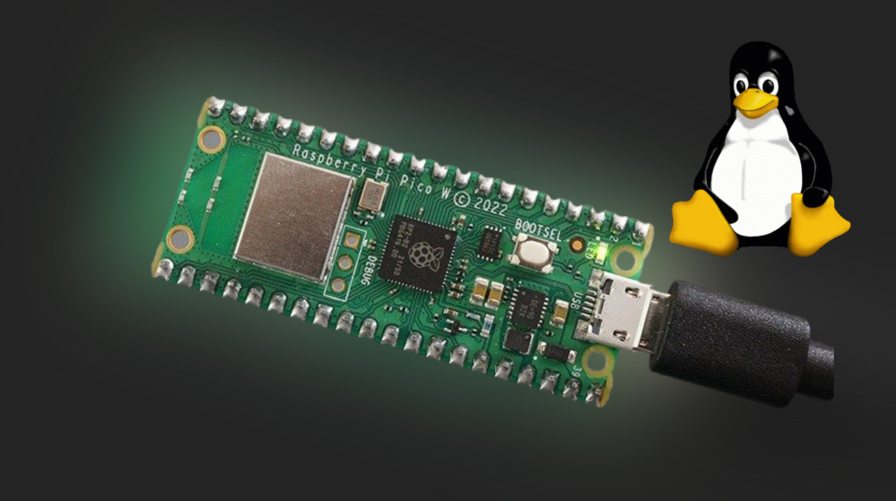
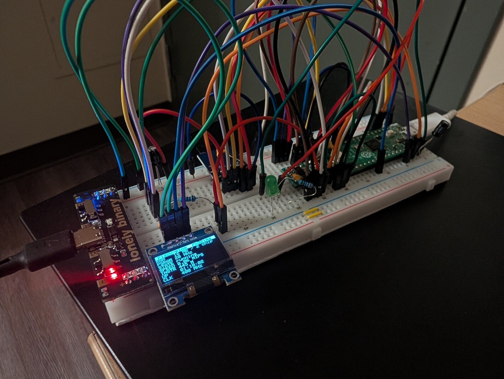

<p align="center">
  
</p>

<h1 align="center">riscv-pico</h1>

<p align="center">
  <strong>A Raspberry Pi Pico running real Linux.</strong><br>
  The RP2040 emulates a RISC-V CPU, SPI PSRAM becomes system memory,<br>
  and the Linux guest drives real GPIO pins.
</p>

<p align="center">
  
  
  
  
  
</p>

<p align="center">
  <a href="#try-it-in-60-seconds-no-hardware">Try it</a> •
  <a href="#how-it-actually-works">How it works</a> •
  <a href="#build-one-yourself">Build one</a> •
  <a href="#downloads">Downloads</a> •
  <a href="PLAN.md">PLAN.md</a>
</p>

---

> [!NOTE]
> **This is a build log, not an upstream improvement.** It's my own vibe-coded "Linux on a Pico"
> project — the real projects below did the hard work; this repo forks, ports, and glues them
> together and writes down what happened. Posted in case it's useful to someone chasing the same
> idea. The code, docs, and this README were written by
> [Claude Code](https://claude.com/claude-code); I directed it, tested on real hardware, and made
> the calls.

### Built on

| Project | What it gave this repo |
| --- | --- |
| **[tvlad1234/pico-rv32ima](https://github.com/tvlad1234/pico-rv32ima)** + **[tiny-rv32ima](https://github.com/tvlad1234/tiny-rv32ima)** | **The fork point.** Actively maintained, and the emulator core everything here runs on. |
| [ElectroBoy404NotFound/pico-linux](https://github.com/ElectroBoy404NotFound/pico-linux) | The multi-chip PSRAM port and LCD console approach. |
| [cnlohr/mini-rv32ima](https://github.com/cnlohr/mini-rv32ima) | The original RV32IMA-in-C emulator all of the above descends from. |
| [xhackerustc/uc-rv32ima](https://github.com/xhackerustc/uc-rv32ima) | The cache implementation this actually runs. |

**Go star their repos, not this one.**

---

## The short version

A Pico has no MMU and about 264 KB of RAM. It was never meant to run an operating system. So:
core 1 of the RP2040 runs a full RV32IMA interpreter, two SPI PSRAM chips stand in for system
memory, and an SD card holds the kernel and root filesystem. Linux boots on top of that — and
custom kernel drivers let the guest reach back out through the emulator to drive **real hardware**.

<p align="center">
  
</p>

<p align="center"><sub>The OLED is reporting on the machine it's plugged into: 16 MB across 2 chips, live MIPS, uptime, 400 MHz clock.</sub></p>

---

## Status

What's actually verified, versus what merely compiles. No wishful thinking in this table.

| | Feature | Notes |
|---|---|---|
| ✅ | **Linux boots on a real Pico** | RP2040, 16 MB PSRAM, 60 MB rootfs off SD. Shell in well under a minute. |
| ✅ | **GPIO from Linux → real pins** | Both `/dev/gpiochipN` (chardev + `libgpiod`) *and* `/sys/class/gpio`. Verified lighting an actual LED. |
| ✅ | **Runs real software** | Tiny BASIC, Lua 5.4.7, GNU nano 7.2 (full-screen), `curl`, `sysinfo`. |
| ✅ | **Custom kernel drivers** | Block device, GPIO, second console channel — real Linux drivers, not shims. |
| ✅ | **Desktop harness** | Boots the same kernel on your PC in ~1s. No hardware needed. |
| ✅ | **SSD1306 OLED panel** | A live stats visualizer. Not essential, just fun. |
| 🚧 | **`pico2` / `pico2_w` (RP2350)** | Builds clean for all four board targets. Never actually flashed. |
| 🚧 | **VGA + PS/2 console** | Real, working code from upstream `pico-rv32ima` — just not wired up and tested here. |
| 🚧 | **TCP/IP to the host** | Stack works, loopback-verified. The host bridge is half-built. |
| ❌ | **I²C / SPI / PWM / ADC for the guest** | Documented as an idea in [PLAN.md](PLAN.md). Deliberately not built. |

---

## Try it in 60 seconds (no hardware)

A desktop build of the **real** emulator core — same kernel, same rootfs, no Pico required.

```sh
harness/build.sh
mkdir images

# current kernel + rootfs, plus the DTB from the networking release
gh release download kernel-gpio-v2 -R flyboy-byte/riscv-pico -p "*.tar.gz" -O - | tar xz -C images
gh release download net-v1 -R flyboy-byte/riscv-pico -p "*.tar.gz" -O - | tar xz -C images dtb

# lay them out on a FAT image the way the firmware expects
dd if=/dev/zero of=harness/disk.img bs=1M count=80
mformat -F -i harness/disk.img ::
mcopy -i harness/disk.img images/Image       ::IMAGE
mcopy -i harness/disk.img images/dtb         ::DTB
mcopy -i harness/disk.img images/rootfs.ext2 ::ROOTFS

python3 harness/desktop_terminal.py harness/disk.img
```

Needs `mtools`, plus `PyQt6` and `python-pyte` (`sudo pacman -S python-pyte` on Arch). Boots to a
shell in a couple of seconds — try `nano`, `curl --version`, `sysinfo`, `gpioinfo gpiochip0`.

> [!IMPORTANT]
> **These images won't boot under stock `mini-rv32ima`.** This project's emulator core adds custom
> block-device and console CSRs that upstream doesn't implement, so `harness/build.sh` builds this
> repo's own desktop copy of the *real* core instead. Background in [CLAUDE.md](CLAUDE.md).

> [!TIP]
> `basic`, `lua`, and `gpiotest` aren't in that rootfs. Grab
> [`apps-v2`](https://github.com/flyboy-byte/riscv-pico/releases/tag/apps-v2) and inject them with
> `debugfs -w` — recipe is in PLAN.md's "apps/" section.

---

## How it actually works

The interesting part isn't that Linux boots. It's that the emulated guest can reach **real
hardware** — so `echo 1 > /sys/class/gpio/gpio512/value`, typed into a Linux shell, ends with
current flowing out of a physical pin.

```
┌─────────────────────────────────────────────────────────────────┐
│  RISC-V Linux guest                                 (emulated)  │
│                                                                 │
│      your shell  ·  BASIC  ·  Lua  ·  nano                      │
│                       │                                         │
│      Linux 6.6, nommu, RV32IMA                                  │
│                       │                                         │
│      drivers:  gpio-tinyrv32  ·  block  ·  console              │
└───────────────────────┬─────────────────────────────────────────┘
                        │   CSR instructions   (GPIO = 0x1a0-0x1a3)
┌───────────────────────┴─────────────────────────────────────────┐
│  RP2040  @ 400 MHz                              (real silicon)  │
│                                                                 │
│      core 1  ──▶  tiny-rv32ima, the RV32IMA interpreter         │
│      core 0  ──▶  CSR handlers, console, OLED                   │
└───────────────────────┬─────────────────────────────────────────┘
                        │
     ┌──────────────────┼──────────────────┬──────────────────┐
     ▼                  ▼                  ▼                  ▼
 2x SPI PSRAM      microSD card        GPIO pins        SSD1306 OLED
 16 MB = RAM     kernel + rootfs     LEDs, buttons      status panel
```

Linux sees ordinary devices — a block device, a `gpiochip`, a console. The RP2040 does the
translating underneath. Full GPIO walkthrough, including wiring an LED and the exact ioctls, is in
**[docs/GPIO_AND_BASIC_TUTORIAL.md](docs/GPIO_AND_BASIC_TUTORIAL.md)**.

---

## Build one yourself

### Parts — about $20

Everything here is what's on the verified build. No minimum order quantities, all single-quantity
friendly. Prices drift; this isn't a live feed.

| Part | Qty | Notes |
| --- | --- | --- |
| Raspberry Pi Pico | 1 | Verified on a Pico H (RP2040). Builds for `pico_w`/`pico2`/`pico2_w` too, but RP2350 is untested. |
| **APS6404L-3SQR-SN** PSRAM, SOP-8 | 2 | 8 MB each → 16 MB. [ProtoSupplies](https://protosupplies.com/product/psram/), ~$2.39 ea. |
| [SMD→DIP 8-pin adapter](https://protosupplies.com/product/pcb-smd-soic-8-msop-8-tssop-8-to-dip-adapter5-pack/) | 1 pack | ~$0.79 for 5. Headers not included. The PSRAM is surface-mount; these get it onto 0.1" pitch. |
| microSD breakout, SPI | 1 | Any 3.3 V module labelled `3V3 CS MOSI CLK MISO GND`. |
| microSD card | 1 | **4–32 GB, FAT32.** Not SDXC/exFAT — Petit FatFs only speaks FAT12/16/32. |
| 10 kΩ resistor | 1 | Pull-up for `SIO2`/`SIO3` on both chips. One resistor covers all four pins. |
| SSD1306 OLED, 128×64 | 0–1 | Optional. Must be the **I²C** 4-pin variant, not SPI. |
| Decoupling caps | a few | 100 nF ceramic + 10–100 µF bulk. Cheap insurance — see the power warning below. |
| Breadboard + jumpers | — | |

> [!CAUTION]
> **Get the `-SN` (SOP-8) suffix, not `-ZR`.** Same silicon, but `-ZR` is USON-8 — a 3×2 mm
> leadless package that is genuinely painful to hand-solder or rework. Plain `APS6404L-3SQR` with
> no suffix is bare die, not a packaged part at all.

**Substitutes work fine.** ESP-PSRAM64H, LY68L6400, and IPUS equivalents share the SOP-8 pinout and
the `0x5D` known-good-die ID the firmware checks for. For stock across distributors, try
[Findchips](https://www.findchips.com/search/APS6404L-3SQR-SN) or
[Octopart](https://octopart.com/search?q=APS6404L-3SQR-SN). No level shifters needed anywhere —
everything is 3.3 V native off the Pico's own rail.

### Wiring

Console is USB-CDC, so no serial adapter needed. Everything is 3.3 V native.

> [!WARNING]
> **On the SD card module, `MOSI` and `CLK` cross over.** The module's header order does not match
> the Pico's pin order. This is the single easiest mistake to make on the whole board, and it costs
> you an afternoon.

<details>
<summary><b>PSRAM — two chips on a shared SPI bus</b></summary>

<br>

They differ only in chip-select:

| Chip pin | Signal | Chip 1 | Chip 2 |
| --- | --- | --- | --- |
| 1 | `/CE` | GP13 (pin 17) | GP14 (pin 19) |
| 2 | `SO` | GP12 (pin 16) | GP12 — shared |
| 5 | `SI` | GP11 (pin 15) | GP11 — shared |
| 6 | `SCLK` | GP10 (pin 14) | GP10 — shared |
| 3, 7 | `SIO2`, `SIO3` | → 3V3 via one shared 10 kΩ | same |
| 4, 8 | `VSS`, `VDD` | GND, 3V3 | GND, 3V3 |

`SIO2`/`SIO3` go unused in SPI mode. Pull them **high**, not low — some pin-compatible parts put an
active-low `/RESET` or `/HOLD` on `SIO3`. One 10 kΩ covers all four pins; nothing ever drives them.

**Default build is two-chip / 16 MB** (`PSRAM_TWO_CHIPS 1` in `hw_config.h`, `EMULATOR_RAM_MB 16` in
`vm_config.h`). Going single-chip? Set them to `0` and `8`. Mismatching them is a compile-time
`#error`, not a silent address-wrap bug that bites you three hours later.
`PSRAM_SPI_SPEED_MHZ` defaults to 20, which stays stable even on messy breadboard leads.

</details>

<details>
<summary><b>microSD card module</b></summary>

<br>

| Module | Pico |
| --- | --- |
| `CS` | GP0 (pin 1) |
| `MOSI` | GP3 (pin 5) |
| `CLK` | GP2 (pin 4) |
| `MISO` | GP4 (pin 6) |

⚠️ **`MOSI` and `CLK` cross over** — see the warning above. The module's header order does not
match the Pico's pin order.

The card itself is plain FAT32 with `IMAGE`, `DTB`, and `ROOTFS` in the root. No special
formatting.

</details>

<details>
<summary><b>SSD1306 OLED status panel (optional)</b></summary>

<br>

Four separate jumpers — there's no free adjacent GPIO pair left on the board:

| Module | Pico |
| --- | --- |
| `VCC` | 3V3(OUT) (pin 36) |
| `GND` | GND (pin 28) |
| `SDA` | GP28 (pin 34) |
| `SCL` | GP21 (pin 27) |

Shows RAM/PSRAM config, boot stage, live MIPS, uptime, and clock — a stats panel, not a second
console. It runs on core 0, which the emulator never touches, and probes at boot: with nothing
attached, the firmware behaves exactly as if the code weren't there. Disable entirely with
`CONSOLE_OLED 0` in `hw_config.h`. If a panel is wired but stays blank, try `OLED_I2C_ADDR 0x3D`.

</details>

> [!WARNING]
> **Breadboard power is the thing that will actually bite you.** Wiring up the OLED destabilised
> the PSRAM bus and crashed boot — despite the two sharing no GPIO pins at all. The cause was a
> single 3V3 supply pin feeding PSRAM VCC, both chips' pull-ups, the SD card *and* the OLED, so any
> load spike on that node bled into everything else on it.
>
> The fix was a single-point (star) power layout: separate supply for OLED/SD, PSRAM on its own
> clean VCC/GND, short jumpers, and decoupling caps at each chip's supply pins. **If you see random
> resets or PSRAM failures that only appear once a second peripheral is wired up, check power
> distribution before you suspect the chip.** Full writeup — including the wrong theories tried
> first — in [PLAN.md](PLAN.md) and [docs/HARDWARE_SCHEMATIC.md](docs/HARDWARE_SCHEMATIC.md).

### Firmware

**Just want to flash something?** Grab
**[`pico-rv32ima-boards-v5`](https://github.com/flyboy-byte/riscv-pico/releases/tag/pico-rv32ima-boards-v5)**
— prebuilt `.uf2` for all four board variants, ready to go.

<details>
<summary><b>Or build it from source</b></summary>

<br>

```sh
# once — Pico SDK, shallow clone with just the tinyusb submodule (~65 MB)
git clone -b 2.1.1 --depth 1 https://github.com/raspberrypi/pico-sdk.git ~/pico-sdk
git -C ~/pico-sdk submodule update --init --depth 1 lib/tinyusb

firmware/build.sh              # all four boards → firmware/out/*.uf2
firmware/build.sh pico2_w      # or just one
```

About 140 KB per board. Flash by holding **BOOTSEL** while plugging in the Pico — it mounts as a
USB drive called `RPI-RP2` — then copy the `.uf2` across. `pico-rv32ima` wants `IMAGE`/`DTB`/
`ROOTFS` in the root of a FAT16/FAT32 card; `pico-linux` wants a single `Image`, already shipped at
`upstream/pico-linux/linux/Image`.

</details>

---

## Writing your own programs

There's a real cross-compiler for this target — `riscv32-buildroot-linux-uclibc-gcc`, producing the
`bFLT` no-MMU binary format the kernel needs. `apps/` has working examples to copy: a Tiny BASIC
interpreter (`basic.c`), a GPIO chardev smoke test (`gpiotest.c`), `sysinfo.sh`. Lua 5.4.7 and GNU
nano 7.2 build the same way straight from unmodified upstream sources — they're not vendored here.

The toolchain isn't checked in (it's a full buildroot build). The rebuild recipe, plus several
gotchas already solved so you don't rediscover them, lives in PLAN.md's "Cross-compile toolchain"
and "Real GNU nano" sections.

---

## Downloads

Build outputs ship as GitHub releases rather than committed binaries, which keeps `git clone` fast.

| Release | Contents |
| --- | --- |
| **[`pico-rv32ima-boards-v5`](https://github.com/flyboy-byte/riscv-pico/releases/tag/pico-rv32ima-boards-v5)** | **Current firmware**, all four boards — 16 MB two-chip, OLED panel, GPIO CSRs. |
| **[`kernel-gpio-v2`](https://github.com/flyboy-byte/riscv-pico/releases/tag/kernel-gpio-v2)** | **Current kernel + rootfs** — sysfs GPIO, writable root, `libgpiod`, working `sleep`. |
| **[`apps-v2`](https://github.com/flyboy-byte/riscv-pico/releases/tag/apps-v2)** | **Current apps** — `basic`, `lua`, `gpiotest`, `libgpiod` CLI tools. |
| [`toolchain-v2`](https://github.com/flyboy-byte/riscv-pico/releases/tag/toolchain-v2) | The cross-compiler, wchar-enabled (needed for nano/ncurses). |
| [`rv32harness-v1`](https://github.com/flyboy-byte/riscv-pico/releases/tag/rv32harness-v1) | Desktop harness binaries, x86-64 Linux. |
| [`apps-v1`](https://github.com/flyboy-byte/riscv-pico/releases/tag/apps-v1) | `nano` and `sysinfo` (still current). Everything else superseded by `apps-v2`. |
| [`net-v1`](https://github.com/flyboy-byte/riscv-pico/releases/tag/net-v1) | TCP/IP stack and second HVC channel. Still the networking reference. |

Older firmware `-v3`/`-v4` still boot fine. `-v1`/`-v2` are superseded single-chip 8 MB builds that
don't boot the current rootfs.

---

## Repo layout

| Path | What | Notes |
| --- | --- | --- |
| `harness/` | *this repo* | Desktop build of the real emulator core, plus a PyQt6 terminal app to drive it. |
| `firmware/` | *this repo* | `build.sh` — one command, `.uf2`s for all four board targets. |
| `apps/` | *this repo* | Small C programs cross-compiled for the target and proven running on it. |
| `buildroot-overlay/` | *this repo* | The kernel patches that create every custom device — block, GPIO, second console. |
| `upstream/pico-rv32ima/` | [tvlad1234](https://github.com/tvlad1234/pico-rv32ima) | The fork this builds on. No longer pristine — the PSRAM port lives here. |
| `upstream/pico-rv32ima/tiny-rv32ima/` | [tvlad1234](https://github.com/tvlad1234/tiny-rv32ima) | The emulator core. Also edited by the same port. |
| `upstream/pico-linux/` | [ElectroBoy404NotFound](https://github.com/ElectroBoy404NotFound/pico-linux) | Reference only, still pristine. Source of the PSRAM port logic. |

All three `upstream/` paths are `git subtree`s with full history, so `git log -- upstream/<x>` works
and upstream changes can still be pulled — commands in [CLAUDE.md](CLAUDE.md).

**[PLAN.md](PLAN.md) is the living state doc** — every decision, every bug, every dead end, and
what's next. It's far more detailed than this file.

---

## License

This repo's own code (`harness/`, `apps/`, `firmware/`, `buildroot-overlay/`, docs) is MIT — see
[LICENSE](LICENSE). Everything under `upstream/` keeps its original licensing (MIT / Apache-2.0 /
BSD-3); see the `LICENSE` in each subtree.
